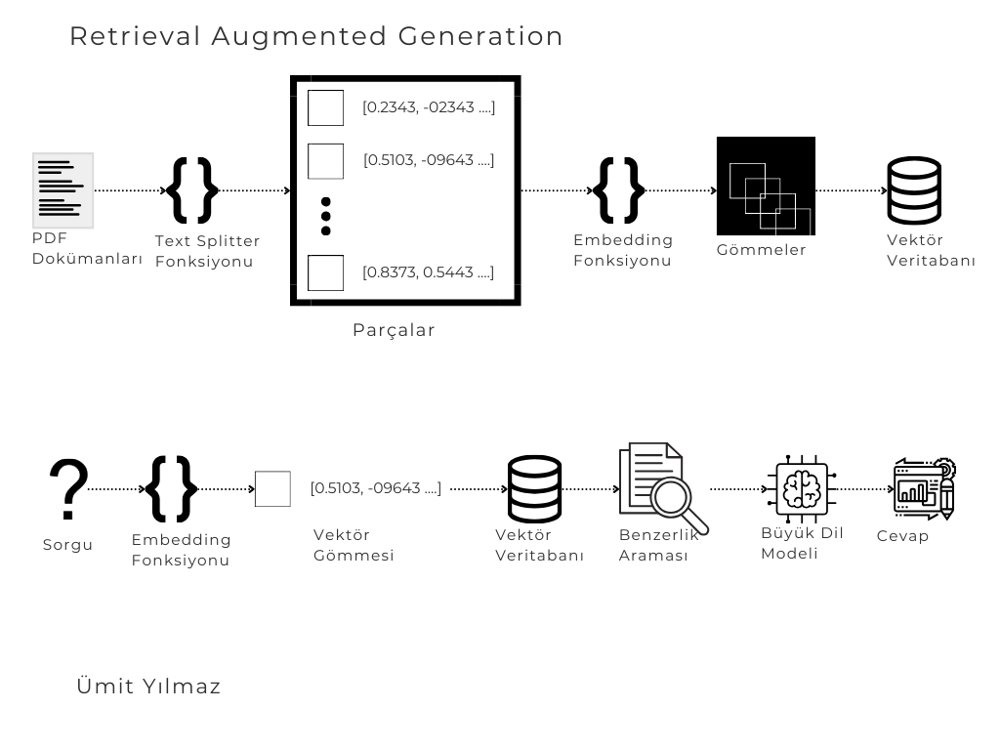

# RAG-Local-LLM
This project is an implementation of RAG technology which stands for Retrieval-Augmented Generation.


# RAG Pipeline


# 1 - Setup Part

#### 1.1 - Install Ollama

1. Download Ollama from the given link: [https://ollama.com/](https://ollama.com/)

2. Download Mistral for Ollama in terminal: 
   ```sh
   ollama pull mistral
   ```

3. Download text encoder for Ollama in terminal: 
   ```sh
   ollama pull nomic-embed-text
   ```

#### 1.2 - Install Repo

1. Create a directory in your workspace.
2. Change directory into your project folder.
3. Clone the repo to the project folder:

4. Create a virtual environment:
   ```sh
   python -m venv env
   ```
5. Activate the virtual environment:
   - Unix/MacOS:
     ```sh
     source env/bin/activate
     ```
   - Windows:
     ```sh
     .\env\Scripts\activate
     ```
6. Install the required packages:
   ```sh
   pip install -r requirements.txt
   ```

# 2 - Build Vector Database

1. Add PDF documents into the `data` folder**
2. Run the database population script:
   ```sh
   python createVectorDatabase.py
   ```
   or start from scratch with the `--reset` argument:
   ```sh
   python createVectorDatabase.py --reset
   ```
3. Wait until the building process is done.


# 3 - Run Locally

1. Open a terminal and start Ollama:
   ```sh
   ollama serve
   ```
2. Open another terminal in the project folder and run the server:
   ```sh
   python server.py
   ```
3. Go to `localhost:5000` or the given IP in the second terminal.
4. Ask a question based on the context that you uploaded to the `data` folder.
   
     ```sh
   python ask.py "What is RAG?"
   ```

# **Data Folder

In Unix systems, file paths are written using forward slashes (/):

```python
# File path for Unix systems
images_dir_unix = "/images"
print(images_dir_unix)
```

In Windows systems, file paths are written using backslashes (\). However, in Python, backslashes are escape characters, so you should use double backslashes (\\) or raw strings:

```python
# File path for Windows systems (using double backslashes)
images_dir_windows = "\\images"
# or using raw strings
images_dir_windows_raw = r"\images"
print(images_dir_windows)
print(images_dir_windows_raw)
```

## License

This project is licensed under the MIT License - see the LICENSE file for details.

## Authors

List the authors of the project.

- **Ümit** - *Initial work* 


# RAG Hattı



# 1 - Kurulum Bölümü
#### 1.1 - Ollama'yı Kurun

1. Ollama'yı verilen bağlantıdan indirin: [https://ollama.com/](https://ollama.com/)

2. Terminalden Ollama Mistral'ı indirin: 
   ```sh
   ollama pull mistral
   ```

3. Terminalden Ollama için metin kodlayıcıyı indirin: 
   ```sh
   ollama pull nomic-embed-text
   ```

#### 1.2 - Repoyu Yükleyin

1. Çalışma alanınızda bir dizin oluşturun.
2. Proje klasörünüze geçin.
3. Depoyu proje klasörüne klonlayın
4. Sanal bir ortam oluşturun:
   ```sh
   python -m venv env
   ```
5. Sanal ortamı etkinleştirin:
   - Unix/MacOS:
     ```sh
     source env/bin/activate
     ```
   - Windows:
     ```sh
     .\env\Scripts\activate
     ```
6. Gerekli paketleri yükleyin:
   ```sh
   pip install -r requirements.txt
   ```

# 2 - Vektör Veritabanını Oluşturun

1. PDF belgelerinizi `data` klasörüne ekleyin**
2. Veritabanı popülasyon skriptini çalıştırın:
   ```sh
   python createVectorDatabase.py
   ```
   veya sıfırdan başlamak isterseniz `--reset` argümanı ile çalıştırın:
   ```sh
   python createVectorDatabase.py --reset
   ```
3. Oluşturma işlemi tamamlanana kadar bekleyin.

# 3 - Yerel Olarak Çalıştırma

1. Bir terminal açın ve Ollama'yı başlatın:
   ```sh
   ollama serve
   ```
2. Proje klasörünüzde başka bir terminal açın ve sunucuyu başlatın:
   ```sh
   python server.py
   ```
3. Tarayıcınızda `localhost:5000` adresine veya ikinci terminalde belirtilen IP adresine gidin.
4. `data` klasörüne yüklediğiniz belgelerden yararlanarak bir soru sorun.
   
     ```sh
   python ask.py "What is RAG?"
   ```

### **Data Klasörü

Unix sistemlerinde dosya yolları ileri eğik çizgi (/) kullanılarak yazılır:

```python
# Unix sistemleri için dosya yolu
images_dir_unix = "/images"
print(images_dir_unix)
```

Windows sistemlerinde dosya yolları geri eğik çizgi (\) kullanılarak yazılır. Ancak, Python'da geri eğik çizgi kaçış karakteri olduğundan, çift geri eğik çizgi (\\) kullanmalısınız veya ham string (`r`) kullanabilirsiniz:

```python
# Windows sistemleri için dosya yolu (çift geri eğik çizgi kullanarak)
images_dir_windows = "\\images"
# veya ham string kullanarak
images_dir_windows_raw = r"\images"
print(images_dir_windows)
print(images_dir_windows_raw)
```

## Lisans

Bu proje MIT Lisansı altında lisanslanmıştır - daha fazla bilgi için LICENSE dosyasına bakın.


- **Ümit** - *Başlangıç çalışması* 


